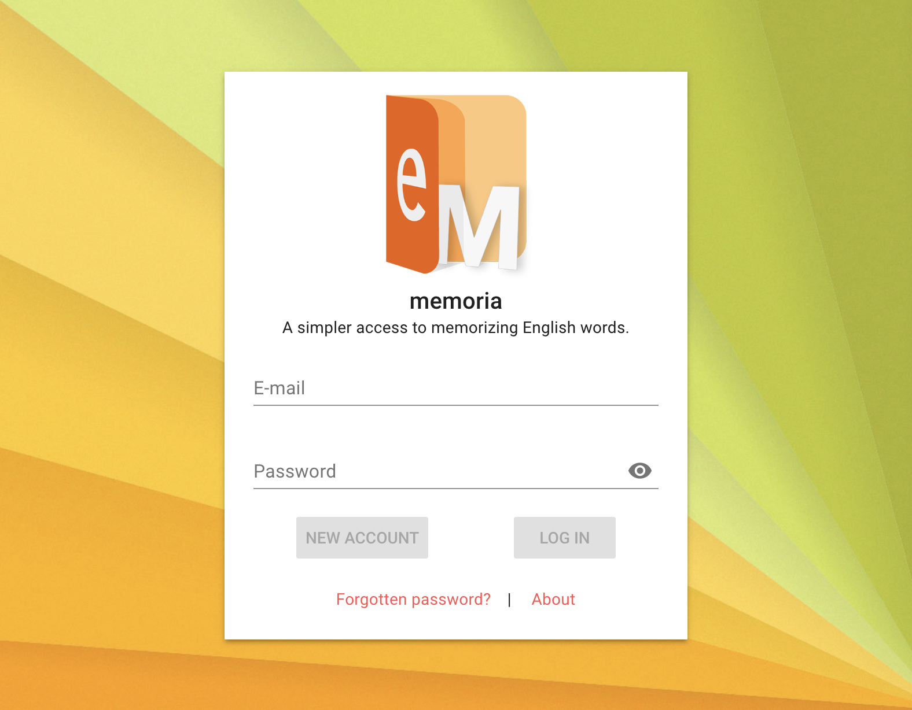
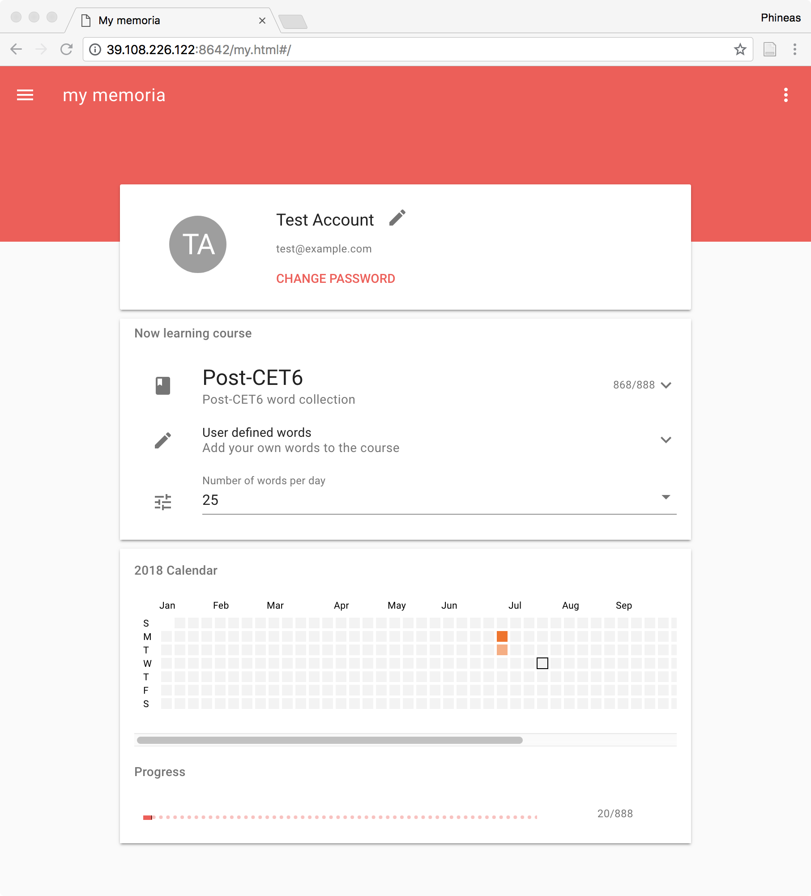
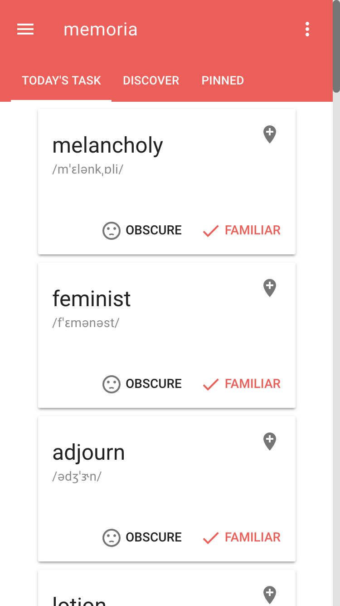

# memoria

> Memorizing words

*Vue + MongoDB + Express*

memoria is a web app for you to memorize words better. 







## Dependencies

- Vue.js
- Vue Material
- Vue Waterfall
- Vee Validate
- Axios
- D3
- JSON Web Token

- Express
- MongdDB node connector
- Node mailer

## Build Setup

``` bash
# install dependencies
npm install

# build for production with minification
npm run build

# build for production and view the bundle analyzer report
npm run build --report

# run the server including the api
npm run server
```

For a detailed explanation on how things work, check out the [guide](http://vuejs-templates.github.io/webpack/) and [docs for vue-loader](http://vuejs.github.io/vue-loader).

## Dev

To deploy and configure the project, you need to modify the file `config/conf.server.js`

```javascript
module.exports = {
    // This is the very important salt used for encryption
    // Modification of the string may result the database to invalid status
    auth            : true,
    serverPort      : 8081,
    mongoURL        : 'mongodb://localhost:27017/',
    mongoHost       : 'localhost',
    mongoPort       : 27017,
    getStaticPath   : path => ('/' + path).replace('//', '/'),
    getApiPath      : path => ('/api/' + path).replace('//', '/'),
    getApiHost      : path => 'http://' + ('localhost:8081/' + path).replace('//', '/'),
    getVueHost      : path => 'http://' + ('localhost:8081/' + path).replace('//', '/'),
    mailConfig      : {
        service: 'hotmail',
        auth: {
            user: 'memoria-no-reply@outlook.com',
            pass: 'memoriaN0Reply'
        }
    }
}
```

You may also run the webpack dev server, if you have correctly configured `conf.server.js` and run the server.

```bash
npm run dev
```
